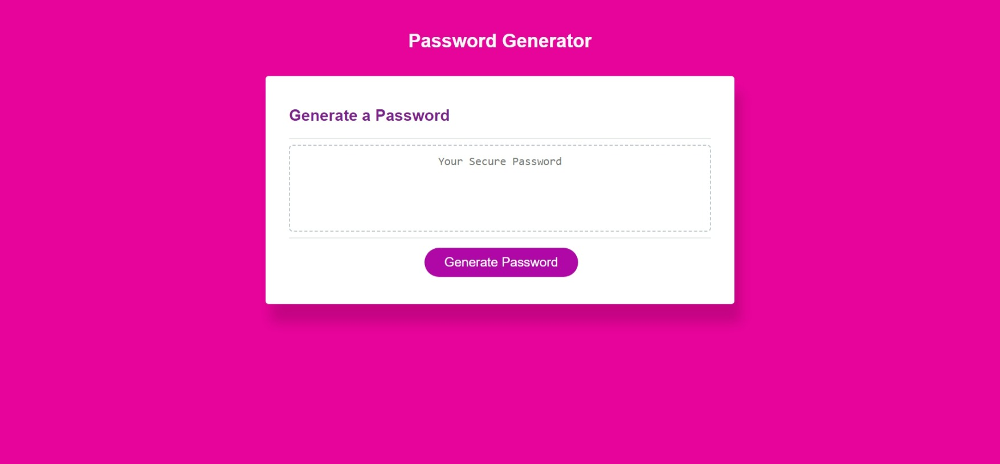

# ✨ Password-Generator

## 💡 Description

Application that can be used to generate a random password. 
## 📌 Instalation

N/A

---

## 📌 Usage

This app runs in the browser, and feature dynamically updating HTM and CSS powered by JavaScript code. It has a clean and polished and responsive user interface that adapts to multiple screen sizes.

---

## 📷 Screenshot

## 🎯 Link

[Click here to access!]( https://adriana-camarotto.github.io/Password-Generator/)

---

## 🚀 Tecnologies

- HTML
- CSS
- JavaScript

---

## 📚 What have I learned.

- Define and use JavaScript objects;
- Access data in Objects using Object Methods;
- Build and iterate nested data structures;
- Write a function expression and a function declaration;
- Organize code through the use of functions;
- Identify the difference between global and local scope;
- Use custom JavaScript object methods;
- Explain and use the this keyword;
- Implement array methods.

---

## 📌 Credits

N/A

---

## 👉🏻 Lisence

Please refer to the LICENSE in the repo.

---

## 📧 Contact

adriana.camarotto@gmail.com

